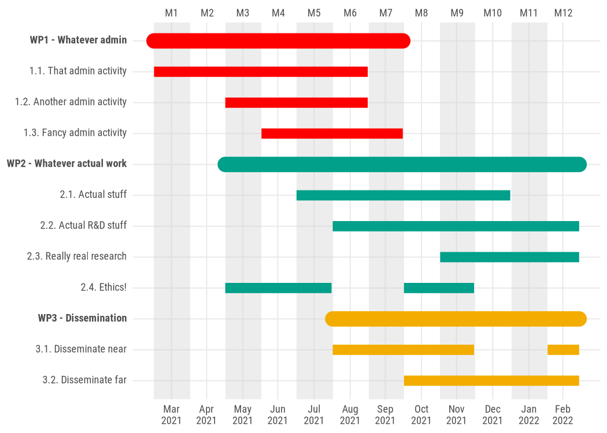

<!-- README.md is generated from README.Rmd. Please edit that file -->

# ganttrify

<!-- badges: start -->

[](https://www.tidyverse.org/lifecycle/#experimental)
<!-- badges: end -->

`ganttrify` facilitates the creation of nice-looking Gantt charts,
commonly used in project proposals and project management.

## Motivation

It is possible to find online documented attempts at facilitating the
creation of Gantt charts from R. Some of them (e.g.
[this](https://www.molecularecologist.com/2019/01/simple-gantt-charts-in-r-with-ggplot2-and-the-tidyverse/)
and [this](https://davetang.org/muse/2017/02/03/gantt-chart-using-r/))
use ‘ggplot2’, but I feel they do not look very nice. The same goes for
the answers I found in the [relevant Stackoverflow
question](https://stackoverflow.com/questions/3550341/gantt-charts-with-r).

Even
[Plotly](https://moderndata.plot.ly/gantt-charts-in-r-using-plotly/)
enables the creation of Gantt charts in R, but again, I don’t like the
end result.

I did find a [solution that was rather visually
satisfying](https://insileco.github.io/2017/09/20/gantt-charts-in-r/),
but it was in base R, and all the cool kids nowadays know that base
plotting in R exists only [for compatibility with
S](https://twitter.com/whydoesr): not an option\! (Hey, I’m joking,
don’t @ me\!)

Given what is evidently my posh taste for Gantt charts, I had no other
option than making this package with a pretentious, gentrified name,
rather then the obvious “ganttr”.

Please welcome `ganttrify`.

## Disclaimer

More seriously, this has been a quick attempt at making decent-looking
Gantt charts. They are really not that beautiful (yet).

And yes, I will enable all the customisations you like, but first I
actually need to submit this project.

## Features

Take an adequately formatted spreadsheet and turn it into a Gantt chart
made with ggplot2.

## Future features

  - further customisation and more options
  - shiny app to facilitate creation and editing of Gantt charts for
    non-R users

## Installation

You can install the development version from
[GitHub](https://github.com/) with:

``` r
# install.packages("devtools")
devtools::install_github("giocomai/ganttrify")
```

## Example

Here is an example
project:

| wp                         | activity                    | start\_month | end\_month |
| :------------------------- | :-------------------------- | -----------: | ---------: |
| WP1 - Whatever admin       | 1.1. That admin activity    |            1 |          6 |
| WP1 - Whatever admin       | 1.2. Another admin activity |            3 |          6 |
| WP1 - Whatever admin       | 1.3. Fancy admin activity   |            4 |          5 |
| WP2 - Whatever actual work | 2.1. Actual stuff           |            5 |         10 |
| WP2 - Whatever actual work | 2.2. Actual R\&D stuff      |            6 |         12 |
| WP2 - Whatever actual work | 2.3. Really real research   |            9 |         12 |
| WP2 - Whatever actual work | 2.4. Ethics\!               |            3 |          5 |
| WP2 - Whatever actual work | 2.4. Ethics\!               |            8 |          9 |
| WP3 - Dissemination        | 3.1. Disseminate near       |            6 |          9 |
| WP3 - Dissemination        | 3.1. Disseminate near       |           12 |         12 |
| WP3 - Dissemination        | 3.2. Disseminate far        |            8 |         12 |

Month since the beginning of the project are used as reference in order
to make it easier to change the date when the project starts without
needing to change the timing of all activities.

``` r
library("ganttrify")

ganttrify(df = df, start_date = "2020-03")
```


