<!-- README.md is generated from README.Rmd. Please edit that file -->

# ganttrify

<!-- badges: start -->

[](https://www.tidyverse.org/lifecycle/#experimental)
<!-- badges: end -->

`ganttrify` facilitates the creation of nice-looking Gantt charts,
commonly used in project proposals and project management.

If you just want to check this out in an interactive web interface,
[click here and enjoy](https://ganttrify.europeandatajournalism.eu/).
Some more [context in this blog
post](https://medium.com/european-data-journalism-network/beautiful-gantt-charts-with-ggplot2-80ccd8c2c788).

Read on for more details and examples.

## Motivation

It is possible to find online documented attempts at facilitating the
creation of Gantt charts from R. Some of them
(e.g. [this](https://www.molecularecologist.com/2019/01/simple-gantt-charts-in-r-with-ggplot2-and-the-tidyverse/)
and [this](https://davetang.org/muse/2017/02/03/gantt-chart-using-r/))
use ‘ggplot2’, but I feel they do not look very nice. The same goes for
the answers I found in the [relevant Stackoverflow
question](https://stackoverflow.com/questions/3550341/gantt-charts-with-r).

Even
[Plotly](https://moderndata.plot.ly/gantt-charts-in-r-using-plotly/)
enables the creation of Gantt charts in R, but again, I don’t like the
end result.

I did find a [solution that was rather visually
satisfying](https://insileco.github.io/2017/09/20/gantt-charts-in-r/),
but it was in base R, and all the cool kids nowadays know that base
plotting in R exists only [for compatibility with
S](https://botsin.space/@whydoesr): not an option! (Hey, I’m joking,
don’t @ me!)

Given what is evidently my posh taste for Gantt charts, I had no other
option than making this package with a pretentious, gentrified name,
instead of the obvious “ganttr”.

Please welcome `ganttrify`.

## Disclaimer

More seriously, this has been a quick attempt at making decent-looking
Gantt charts.

And yes, I will enable all the customisations you like, but first I
actually need to submit this project.

\[Thanks to all who contributed suggestions via issues and pull
requests!\]

\[This package has been developed as a personal endeavour, originally
conceived for grant writing at my employer
([OBCT](https://www.balcanicaucaso.org/)/[CCI](https://www.cci.tn.it/))\].
The Shiny interface, now hosted in [a separate repository](), has been
developed for [EDJNet](https://www.europeandatajournalism.eu/), the
European Data Journalism Network.

## Features

Take an adequately formatted spreadsheet and turn it into a Gantt chart
made with ggplot2.

## Installation

You can install the development version from
[GitHub](https://github.com/) with:

``` r
# install.packages("remotes")
remotes::install_github("giocomai/ganttrify")
```

## Example

Here is an example project:

| wp                         | activity                    | start_date | end_date |
|:---------------------------|:----------------------------|-----------:|---------:|
| WP1 - Whatever admin       | 1.1. That admin activity    |          1 |        6 |
| WP1 - Whatever admin       | 1.2. Another admin activity |          3 |        6 |
| WP1 - Whatever admin       | 1.3. Fancy admin activity   |          4 |        7 |
| WP2 - Whatever actual work | 2.1. Actual stuff           |          5 |       10 |
| WP2 - Whatever actual work | 2.2. Actual R&D stuff       |          6 |       12 |
| WP2 - Whatever actual work | 2.3. Really real research   |          9 |       12 |
| WP2 - Whatever actual work | 2.4. Ethics!                |          3 |        5 |
| WP2 - Whatever actual work | 2.4. Ethics!                |          8 |        9 |
| WP3 - Dissemination        | 3.1. Disseminate near       |          6 |        9 |
| WP3 - Dissemination        | 3.1. Disseminate near       |         12 |       12 |
| WP3 - Dissemination        | 3.2. Disseminate far        |          8 |       12 |

Month since the beginning of the project are used as reference in order
to make it easier to change the date when the project starts without
needing to change the timing of all activities.

If you prefer to include dates instead of month numbers, please see
additional examples below.

``` r
library("ganttrify")

ganttrify(
  project = ganttrify::test_project,
  project_start_date = "2021-03",
  font_family = "Roboto Condensed"
)
```

 \[all
examples in this page will use the `Roboto condensed` font; if it is not
installed, you can use the default `sans`. See the *Troubleshooting*
section at the bottom of this readme.\]

“But what if I wanted to add spot labels for events, deliverables,
outputs, milestones, things like that?”, you asked.

Just put them in a table with these column names, and you will be
served.

| activity                   | spot_type | spot_date |
|:---------------------------|:----------|----------:|
| 1.1. That admin activity   | D         |         5 |
| 1.3. Fancy admin activity  | E         |         7 |
| 2.2. Actual R&D stuff      | O         |         7 |
| 2.2. Actual R&D stuff      | O         |         9 |
| 2.2. Actual R&D stuff      | O         |        11 |
| WP2 - Whatever actual work | M         |         6 |

``` r
ganttrify(
  project = ganttrify::test_project,
  spots = ganttrify::test_spots,
  project_start_date = "2021-03",
  font_family = "Roboto Condensed"
)
```


“I can’t read the text, can I change the text size?”, I heard. “Also, is
it possible to outline quarters?”

You’re welcome.

``` r
ganttrify(
  project = ganttrify::test_project,
  spots = ganttrify::test_spots,
  project_start_date = "2021-03",
  size_text_relative = 1.2,
  mark_quarters = TRUE,
  font_family = "Roboto Condensed"
)
```


It appears that some of you don’t like having a line for the working
package and are fine with just lines for activities. Did you mean it
like this? (also, consider setting `hide_activities` to TRUE if on the
contrary you want to hide activities and keep only working packages)

``` r
ganttrify(
  project = ganttrify::test_project,
  hide_wp = TRUE,
  font_family = "Roboto Condensed"
)
```

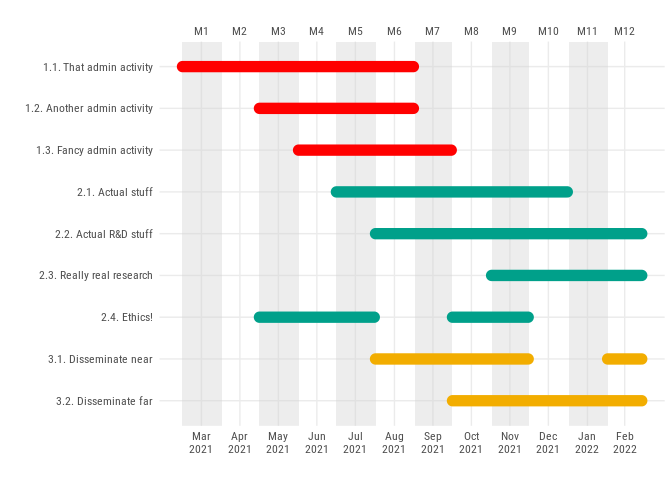

Or perhaps, you did want to keep the name of working package on the
left, but just felt that the horizontal line for the WP is redundant?
Let’s make the WP lines invisible, and nobody will ever know they’re
there!

``` r
ganttrify(
  project = ganttrify::test_project,
  alpha_wp = 0,
  font_family = "Roboto Condensed"
)
```

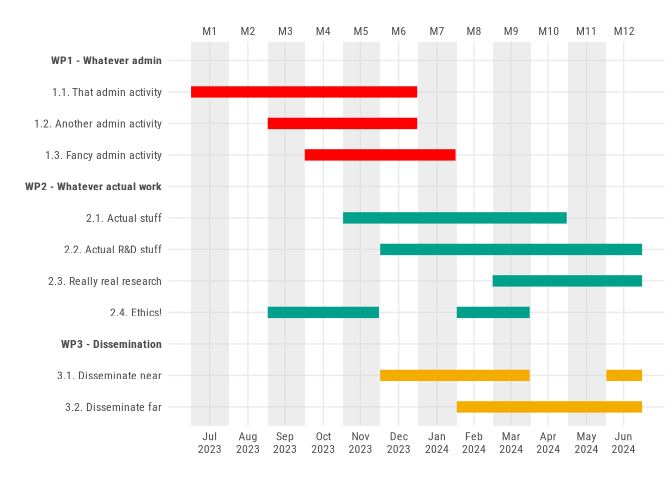

I felt that rounded line endings for the working packages, and “butt”
ending for activities is the best combination of elegance and clarity.

Also, I like full opacity for the lines, but it’s ok if you don’t:

``` r
ganttrify(
  project = ganttrify::test_project,
  project_start_date = "2021-04",
  alpha_wp = 0.9,
  alpha_activity = 0.6,
  line_end_wp = "round", # alternative values: "butt" or "square"
  line_end_activity = "round", # alternative values: "butt" or "square"
  font_family = "Roboto Condensed"
)
```

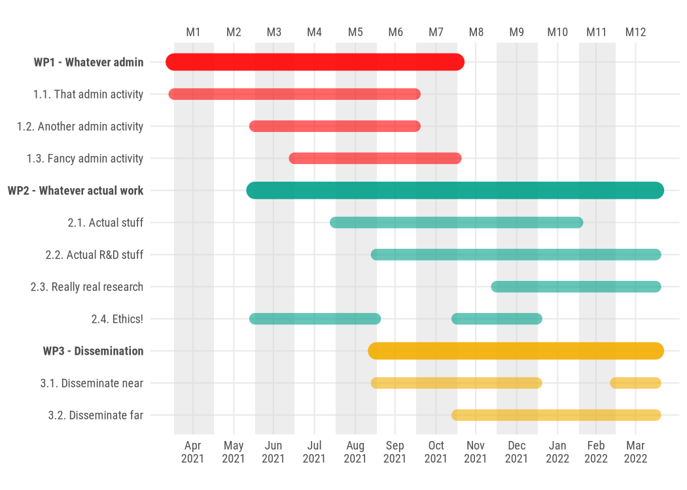
If you use spot events, then there’s all sorts of opinions you can have
about the color and transparency of spot events, as well as the size and
padding around the text. Say, you want a larger box around the text, but
a semi-transparent background? There you go!

``` r
ganttrify(
  project = ganttrify::test_project,
  spots = ganttrify::test_spots,
  project_start_date = "2021-04",
  font_family = "Roboto Condensed",
  spot_size_text_relative = 1.5,
  spot_fill = ggplot2::alpha(c("white"), 0.7),
  spot_padding = ggplot2::unit(0.4, "lines")
)
```

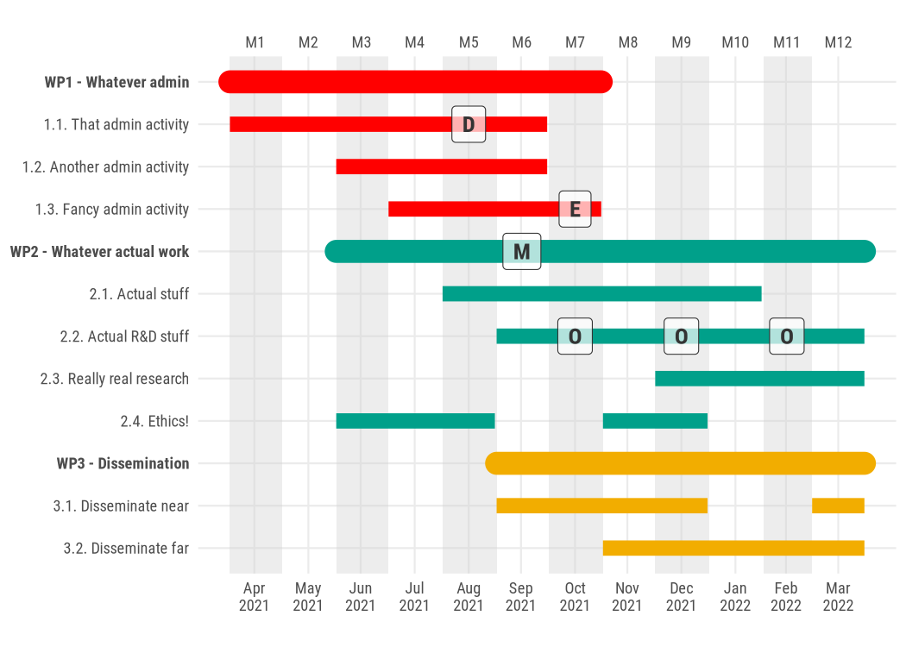
Or perhaps you actually just want the label text, without any
background, or perhaps change the text colour. Be mindful that the text
may become hard to read on darker backgrounds, especially if reviewers
then print your proposal, but… you have been warned:

``` r
ganttrify(
  project = ganttrify::test_project,
  spots = ganttrify::test_spots,
  project_start_date = "2021-04",
  font_family = "Roboto Condensed",
  spot_text_colour = "grey10",
  spot_fontface = "bold",
  spot_fill = NA,
  spot_border = NA
)
```


Some of us work on very long projects, and may need to declutter the
chart to increase readability. So let’s show the month number only once
every three months, and hide the thin vertical lines included by
default.

``` r
test_36 <- ganttrify::test_project
test_36[11, 4] <- 36

ganttrify(
  project = test_36,
  project_start_date = "2021-04",
  month_breaks = 3,
  show_vertical_lines = FALSE,
  font_family = "Roboto Condensed"
)
```

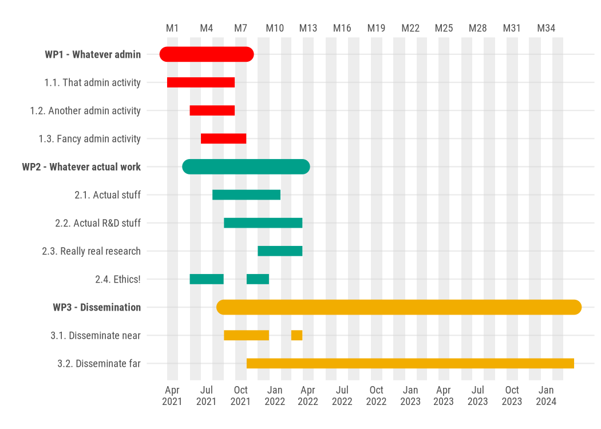

If you have many working packages, you may want to adjust the size of
the output, and choose palettes with more colours. You can always pass a
custom palette (e.g. by setting
`colour_palette = c("#6ACCEA", "#00FFB8", "#B90000", "#6C919C")`), but
if you’re looking for some inspiration, the package
[`MetBrewer`](https://github.com/BlakeRMills/MetBrewer) with palettes
inspired by works at the Metropolitan Museum of Art in New York has some
options that may make your gantt chart even fancier.

``` r
test_project_df <- dplyr::bind_rows(
  ganttrify::test_project,
  tibble::tibble(
    wp = ganttrify::test_project$wp %>% stringr::str_replace(pattern = "1", replacement = "4") %>% stringr::str_replace(pattern = "2", replacement = "5") %>% stringr::str_replace(pattern = "3", replacement = "6"),
    activity = ganttrify::test_project$activity %>% stringr::str_replace(pattern = "^1", replacement = "4") %>% stringr::str_replace(pattern = "^2", replacement = "5") %>% stringr::str_replace(pattern = "^3", replacement = "6"),
    start_date = test_project$start_date + 12,
    end_date = test_project$end_date + 12
  )
)


ganttrify(
  project = test_project_df,
  size_text_relative = 1.2,
  month_breaks = 2,
  project_start_date = "2023-01",
  font_family = "Roboto Condensed",
  colour_palette = MetBrewer::met.brewer("Lakota")
) # or e.g. colour_palette = c("#6ACCEA", "#00FFB8", "#B90000", "#6C919C")
#> Registered S3 method overwritten by 'MetBrewer':
#>   method        from       
#>   print.palette wesanderson
```

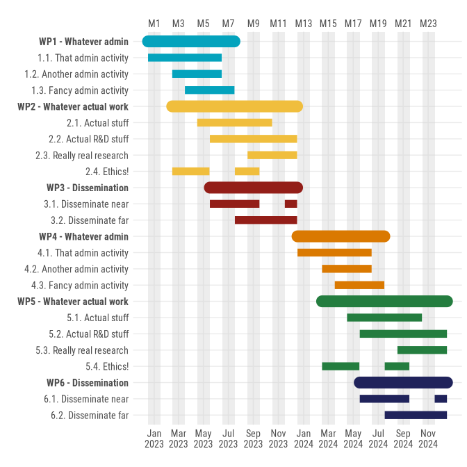

Does right-aligned text bother you?

``` r
ganttrify(
  project = ganttrify::test_project,
  spots = ganttrify::test_spots,
  project_start_date = "2021-04",
  axis_text_align = "left",
  font_family = "Roboto Condensed"
)
```

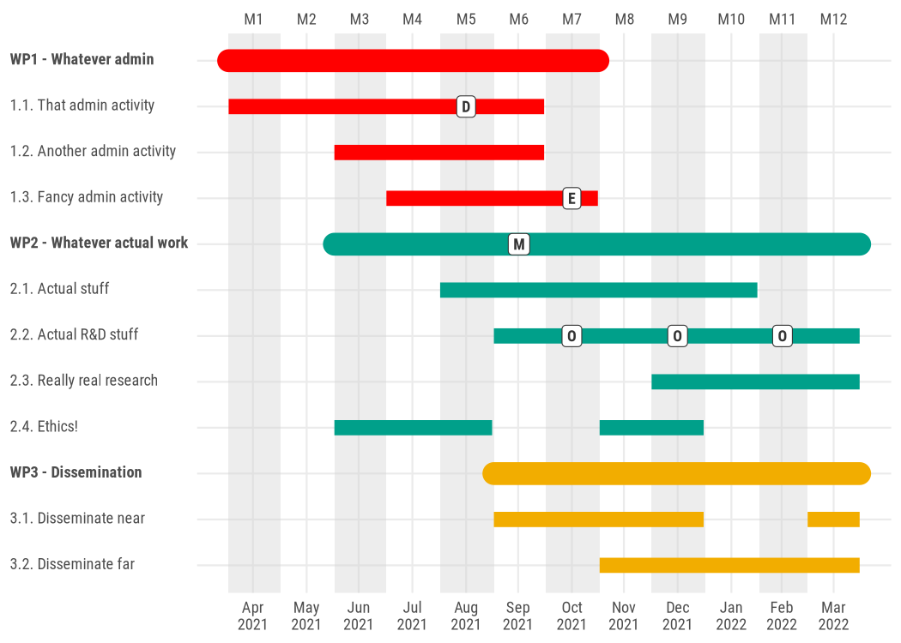

``` r
ganttrify(
  project = ganttrify::test_project,
  spots = ganttrify::test_spots,
  project_start_date = "2021-04",
  axis_text_align = "centre",
  font_family = "Roboto Condensed"
)
```

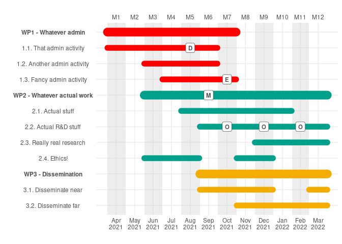

Do you have *very* long names for your activities? The parameter
`label_wrap` is there to help you.

``` r
tibble::tribble(
  ~wp, ~activity, ~start_date, ~end_date,
  "WP 1", "Lorem ipsum dolor sit amet, consectetur adipiscing elit, sed do eiusmod tempor incididunt ut labore et dolore magna aliqua. Aliquet eget sit amet tellus", 1, 6,
  "WP 2", "Proin sed libero enim sed faucibus turpis in eu mi. Massa ultricies mi quis hendrerit dolor magna eget est.", 6, 7,
  "WP 2", "Proin sed libero enim sed faucibus turpis in eu mi. Massa ultricies mi quis hendrerit dolor magna eget est.", 3, 4,
  "WP 2", "Neque laoreet suspendisse interdum consectetur libero id faucibus nisl tincidunt.", 4, 8
) %>%
  ganttrify(
    label_wrap = 32,
    project_start_date = "2023-01",
    font_family = "Roboto Condensed"
  )
```

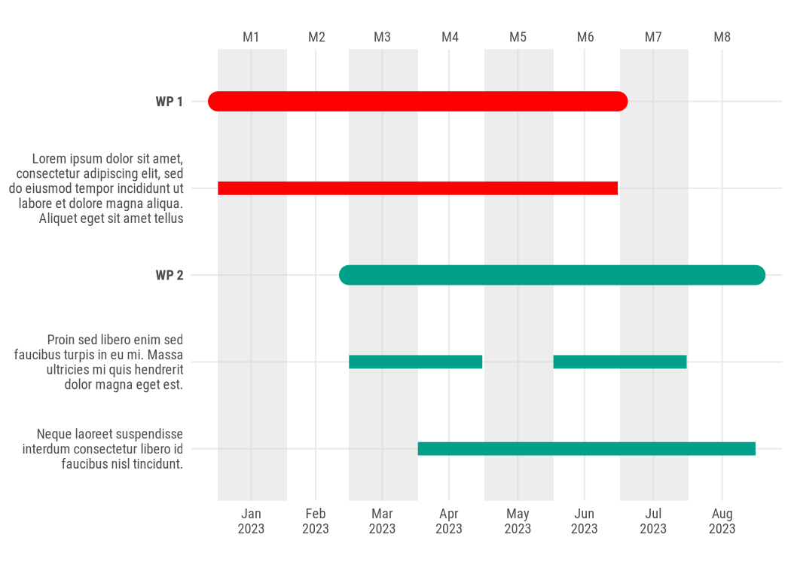

Finally, keep in mind that ganttrify outputs `ggplot` objects. Some
theming options may not behave exactly as you expect, but for example
adding title, subtitle, and captions can be done as you would normally
do with any `ggplot2` graph.

``` r
ganttrify(
  project = ganttrify::test_project,
  spots = ganttrify::test_spots,
  project_start_date = "2020-01",
  font_family = "Roboto Condensed"
) +
  ggplot2::labs(
    title = "My beautiful plans for 2020",
    subtitle = "I will definitely comply with the exact timing of each and all activities*",
    caption = "* I mean, I'll do my best, but if there's a pandemic or something, it's not my fault really"
  )
```

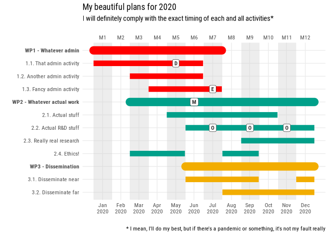

And since it’s a `ggplot2` object, you can export it as you would any
other ggplot graph, by using `ggplot2::ggsave`. This allows also to
customise the size of the final input, running
e.g. `ggplot2::ggsave(filename = "my_gantt.png", width = 12, height = 8, bg = "white")`
after you run the `ganttrify` function (if you set the file extension to
`pdf` or `svg`, you will get the chart in vector format for more clarity
at different zoom levels).

If you are using this in an `rmarkdown` document, keep in mind that you
can set the size at the chunk level, e.g. with something like
`{r fig.width=12, fig.height=8}` in the chunk header.

### Markdown, html, images… it’s all there

Now, to be honest, nobody asked for this. And I’m not even sure it’s a
good idea. But if you are interested in more customisations of how the
wp and activity labels appear, anything supported by
[`ggtext`](https://wilkelab.org/ggtext/) should work here: markdown,
basic html tags, and even inline images.

``` r
funky_project <- tibble::tribble(
  ~wp, ~activity, ~start_date, ~end_date,
  "<span style = 'color:red;'>Red</span> flavour", "Considering <sup>upper</sup> styles", 1, 6,
  "<span style = 'color:red;'>Red</span> flavour", "Or **bold**, or *italic*", 3, 6,
  "Don't forget <span style = 'font-size:6pt'>the small things</span>", "Contribute to Wikidata ", 5, 10,
  "Don't forget <span style = 'font-size:6pt'>the small things</span>", "And to OpenStreetMap ", 7, 12
)

ganttrify(
  project = funky_project,
  project_start_date = "2024-01",
  font_family = "Roboto Condensed"
) +
  ggplot2::ggtitle("Custom activity labels, nothing else to see here")
```

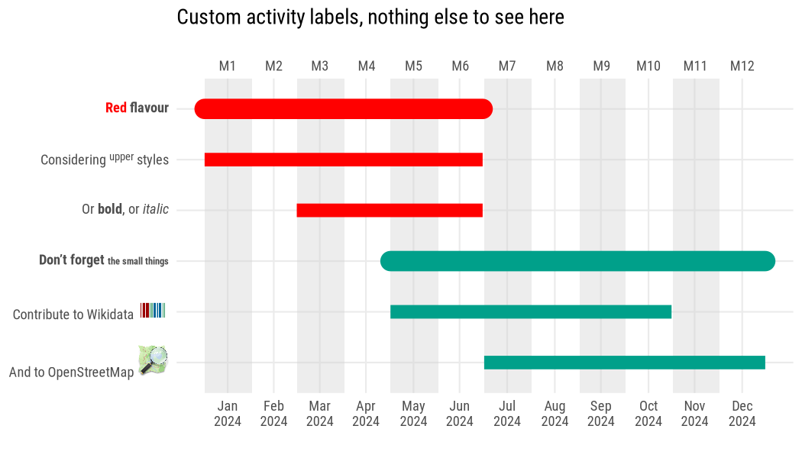

## Shiny app

If you prefer interactive web interfaces to coding, you can still have a
fancy *ganttrified* chart. In order to reduce dependencies and
facilitate checks, this is now available in a separate package,
[`shinyganttrify`](https://github.com/giocomai/shinyganttrify).

Step 1: Make sure you have installed both `ganttrify` and
`shinyganttrify`

``` r
remotes::install_github("giocomai/ganttrify")
remotes::install_github("giocomai/shinyganttrify")
```

Then run:

``` r
shinyganttrify::shiny_ganttrify()
```

You can check it online with no further ado at the following link:

<https://ganttrify.europeandatajournalism.eu/>

(N.B.: not all features are exposed in the Shiny app)

### Shiny app on Docker

Alright, you don’t know like R, but you know how Docker works?

This is all you need to find yourself a nice web app on `localhost`

    docker run -p 80:80 giocomai/ganttrify

You can of course build yourself the docker image using the Dockerfile
included in this repo.

## Additional input formats

Alright, you prefer to use dates rather than month numbers from the
beginning of the project. You’re welcome: just format the date as
follows, and remember to include the `month_number_label = FALSE`
parameter. You can also use exact dates (e.g. `2021-01-01`), but by
default they would still be converted to include the entire month were
that given day falls.

``` r
knitr::kable(ganttrify::test_project_date_month)
```

| wp                         | activity                    | start_date | end_date |
|:---------------------------|:----------------------------|:-----------|:---------|
| WP1 - Whatever admin       | 1.1. That admin activity    | 2021-01    | 2021-06  |
| WP1 - Whatever admin       | 1.2. Another admin activity | 2021-03    | 2021-06  |
| WP1 - Whatever admin       | 1.3. Fancy admin activity   | 2021-04    | 2021-07  |
| WP2 - Whatever actual work | 2.1. Actual stuff           | 2021-05    | 2021-10  |
| WP2 - Whatever actual work | 2.2. Actual R&D stuff       | 2021-06    | 2021-12  |
| WP2 - Whatever actual work | 2.3. Really real research   | 2021-09    | 2021-12  |
| WP2 - Whatever actual work | 2.4. Ethics!                | 2021-03    | 2021-05  |
| WP2 - Whatever actual work | 2.4. Ethics!                | 2021-08    | 2021-09  |
| WP3 - Dissemination        | 3.1. Disseminate near       | 2021-06    | 2021-09  |
| WP3 - Dissemination        | 3.1. Disseminate near       | 2021-12    | 2021-12  |
| WP3 - Dissemination        | 3.2. Disseminate far        | 2021-08    | 2021-12  |

``` r
ganttrify(
  project = ganttrify::test_project_date_month,
  spots = ganttrify::test_spots_date_month,
  by_date = TRUE,
  size_text_relative = 1.2,
  mark_quarters = TRUE,
  font_family = "Roboto Condensed"
)
```

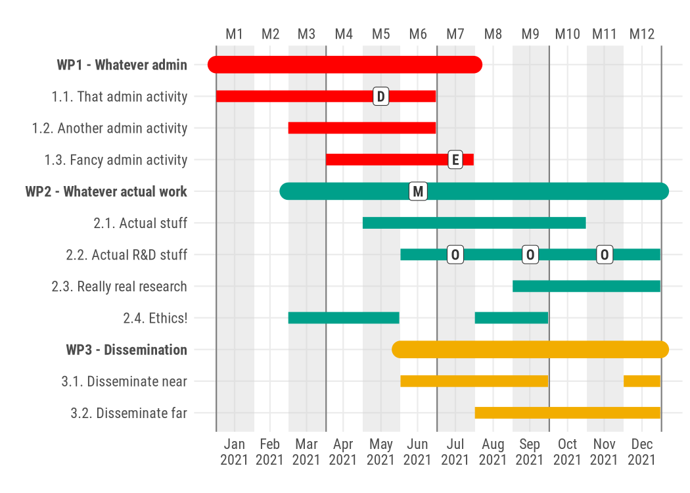

As it turns out, someone wants more detail: they’d like to be able to
input activities with an exact start and end date. I start to suspect
that `ganttrify` at this stage may not be exactly what you’re looking
for, but perhaps this works for you?

``` r
knitr::kable(ganttrify::test_project_date_day)
```

| wp                 | activity           | start_date | end_date   |
|:-------------------|:-------------------|:-----------|:-----------|
| Data team          | Data collection    | 2020-09-01 | 2020-09-10 |
| Data team          | Data processing    | 2020-09-08 | 2020-09-14 |
| Data team          | Reporting          | 2020-09-14 | 2020-09-16 |
| Data team          | Data visualisation | 2020-10-23 | 2020-10-30 |
| Investigative team | Fieldwork          | 2020-09-05 | 2020-09-15 |
| Investigative team | Fieldwork          | 2020-10-10 | 2020-10-20 |
| Investigative team | Writing            | 2020-10-21 | 2020-10-31 |
| Social media team  | Draft outputs      | 2020-10-25 | 2020-10-28 |
| Social media team  | Active promo       | 2020-10-31 | 2020-12-15 |

``` r
ganttrify(
  project = ganttrify::test_project_date_day,
  spots = ganttrify::test_spots_date_day,
  by_date = TRUE,
  exact_date = TRUE,
  size_text_relative = 1.2,
  month_number_label = FALSE,
  font_family = "Roboto Condensed"
)
```

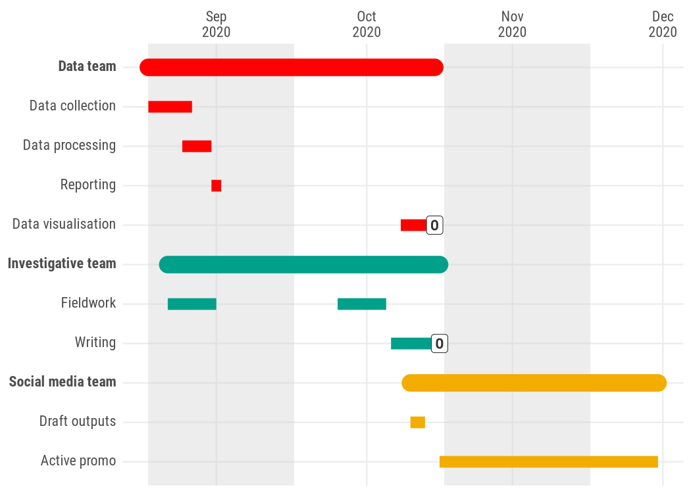

## Troubleshooting

### Structure of the input table

At this stage, the package has strong expectations about the input
format, and does not provide meaningful error messages. If you see
unexpected results, please consider that ideally:

- no cell in the activity column must be empty
- an activity cannot be called the same as a wp
- activities in different wp should have different names (or at least
  add a space at the end or something so that they look different to the
  computer).

Some of these limitations have been mitigated in recent versions. For
example, it is now possible to have activities with the same name in
different working packages, e.g.:

``` r
activities_with_same_name_in_different_wp_project <- tibble::tribble(
  ~wp, ~activity, ~start_date, ~end_date,
  "WP1", "Admin", 1, 6,
  "WP1", "Research", 3, 6,
  "WP1", "Dissemination", 4, 7,
  "WP2", "Admin", 5, 10,
  "WP2", "Research", 6, 12,
  "WP2", "Research", 9, 12,
  "WP2", "Dissemination", 3, 5,
  "WP2", "Dissemination", 8, 9,
  "WP3", "Admin", 6, 9,
  "WP3", "Admin", 12, 12
)

ganttrify(
  project = activities_with_same_name_in_different_wp_project,
  project_start_date = "2024-01",
  font_family = "Roboto Condensed"
)
```

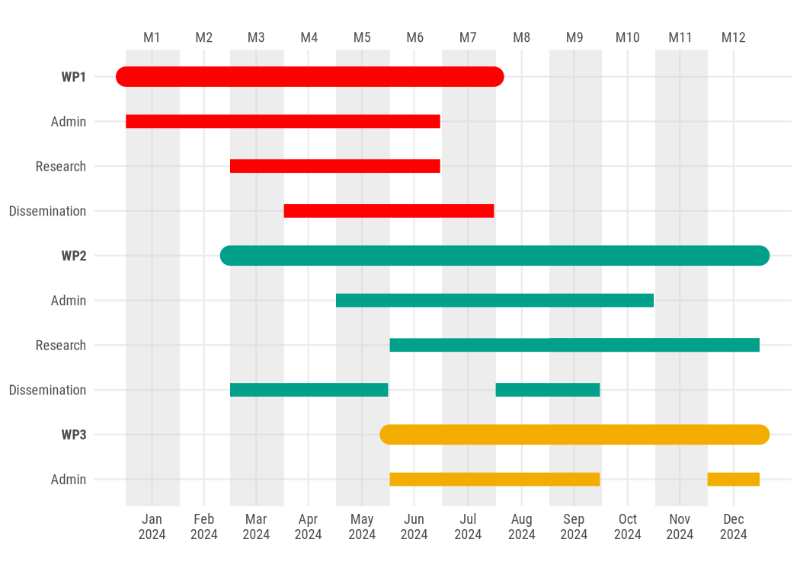

But be mindful that this may lead to unexpected results if you’re using
`spots`; since their placement is currently based exclusively on the
activity name, possible long term fixes would inevitably involve a
change in the input format. An easy (if inelegant) workaround is simply
to add one or more spaces at the end of activities that need to be
differentiated: e.g.to differentiate an activity named admin and present
in both WP1 and WP2 you could name it “Admin” in WP1, but “Admin” in WP2
(notice the additional space in the second case).

### Fonts

By default, this package uses a generic *sans* font but it is
recommended to use a narrow (or condensed font such as *[Roboto
Condensed](https://fonts.google.com/specimen/Roboto+Condensed)* font - a
free font that can be downloaded and installed on any desktop) as they
make more efficient use of text space.

On Fedora, you can install it with
`sudo dnf install google-roboto-condensed-fonts`

On Debian, you can install it with
`sudo apt-get install fonts-roboto-fontface`

After installation, you should make sure the font is available to R by
installing the `extrafont` package, and running
`extrafont::font_import()`.

You can check available fonts also with the package `systemfonts` and
the command `systemfonts::system_fonts()`.
