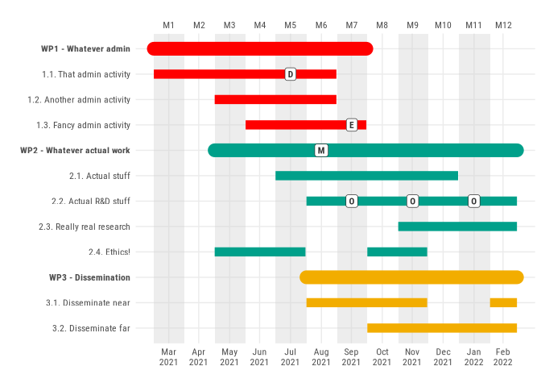
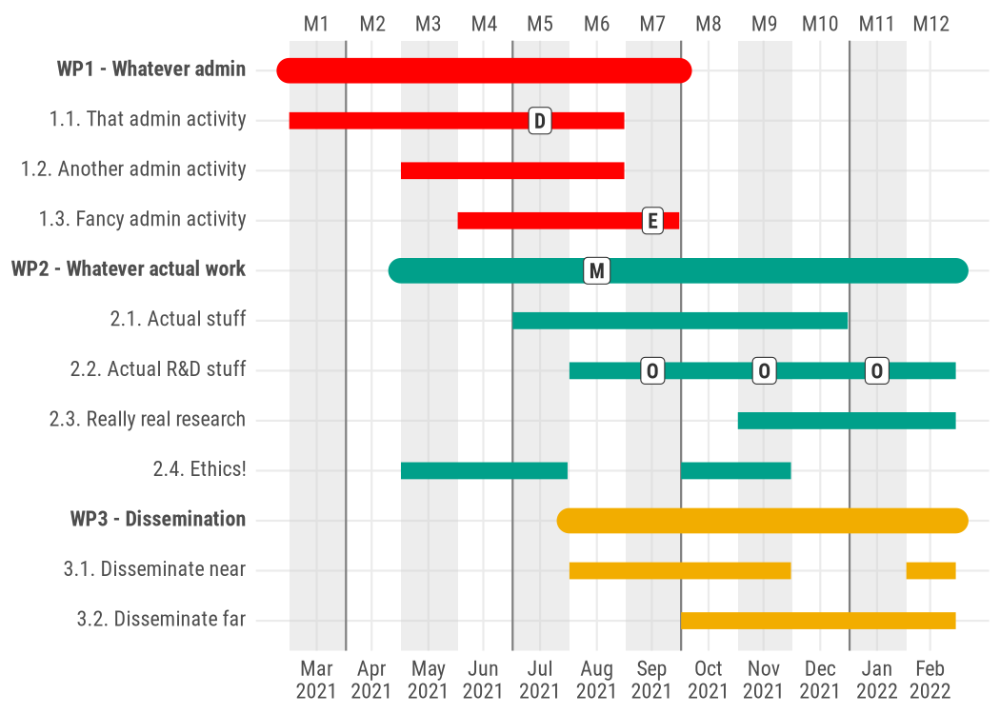
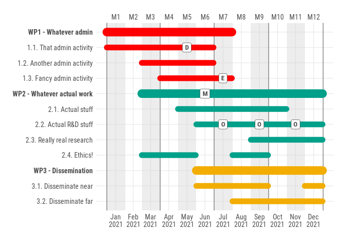
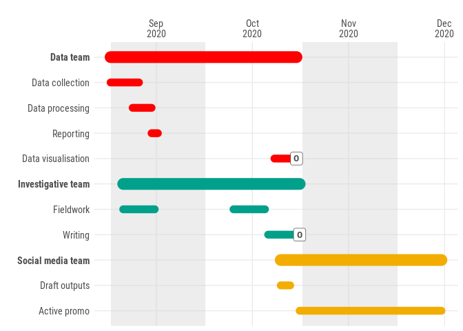

<!-- README.md is generated from README.Rmd. Please edit that file -->

# ganttrify

<!-- badges: start -->

[](https://www.tidyverse.org/lifecycle/#experimental)
<!-- badges: end -->

`ganttrify` facilitates the creation of nice-looking Gantt charts,
commonly used in project proposals and project management.

If you just want to check this out in an interactive web interface,
[click here and enjoy](https://ganttrify.giorgiocomai.eu/).

Read on for more details and examples.

## Motivation

It is possible to find online documented attempts at facilitating the
creation of Gantt charts from R. Some of them
(e.g. [this](https://www.molecularecologist.com/2019/01/simple-gantt-charts-in-r-with-ggplot2-and-the-tidyverse/)
and [this](https://davetang.org/muse/2017/02/03/gantt-chart-using-r/))
use ‘ggplot2’, but I feel they do not look very nice. The same goes for
the answers I found in the [relevant Stackoverflow
question](https://stackoverflow.com/questions/3550341/gantt-charts-with-r).

Even
[Plotly](https://moderndata.plot.ly/gantt-charts-in-r-using-plotly/)
enables the creation of Gantt charts in R, but again, I don’t like the
end result.

I did find a [solution that was rather visually
satisfying](https://insileco.github.io/2017/09/20/gantt-charts-in-r/),
but it was in base R, and all the cool kids nowadays know that base
plotting in R exists only [for compatibility with
S](https://twitter.com/whydoesr): not an option\! (Hey, I’m joking,
don’t @ me\!)

Given what is evidently my posh taste for Gantt charts, I had no other
option than making this package with a pretentious, gentrified name,
instead of the obvious “ganttr”.

Please welcome `ganttrify`.

## Disclaimer

More seriously, this has been a quick attempt at making decent-looking
Gantt charts.

And yes, I will enable all the customisations you like, but first I
actually need to submit this project.

### 2020-05 update

As I’ve seen some people actually started using this package, I have
added some functionalities and significantly improved the shiny app. If
you have used an earlier version, you may need to adapt column names and
some parameter names to the new syntax, following the updated examples
(it should take just a few seconds).

## Features

Take an adequately formatted spreadsheet and turn it into a Gantt chart
made with ggplot2.

## Installation

You can install the development version from
[GitHub](https://github.com/) with:

``` r
# install.packages("remotes")
remotes::install_github("giocomai/ganttrify")
```

## Example

Here is an example project:

| wp                         | activity                    | start\_date | end\_date |
| :------------------------- | :-------------------------- | ----------: | --------: |
| WP1 - Whatever admin       | 1.1. That admin activity    |           1 |         6 |
| WP1 - Whatever admin       | 1.2. Another admin activity |           3 |         6 |
| WP1 - Whatever admin       | 1.3. Fancy admin activity   |           4 |         7 |
| WP2 - Whatever actual work | 2.1. Actual stuff           |           5 |        10 |
| WP2 - Whatever actual work | 2.2. Actual R\&D stuff      |           6 |        12 |
| WP2 - Whatever actual work | 2.3. Really real research   |           9 |        12 |
| WP2 - Whatever actual work | 2.4. Ethics\!               |           3 |         5 |
| WP2 - Whatever actual work | 2.4. Ethics\!               |           8 |         9 |
| WP3 - Dissemination        | 3.1. Disseminate near       |           6 |         9 |
| WP3 - Dissemination        | 3.1. Disseminate near       |          12 |        12 |
| WP3 - Dissemination        | 3.2. Disseminate far        |           8 |        12 |

Month since the beginning of the project are used as reference in order
to make it easier to change the date when the project starts without
needing to change the timing of all activities.

If you prefer to include dates instead of month numbers, please see
additional examples below.

``` r
library("ganttrify")

ganttrify(project = ganttrify::test_project, project_start_date = "2020-03")
```


“But what if I wanted to add spot labels for events, deliverables,
outputs, milestones, things like that?”, you asked.

Just put them in a table with these column names, and you will be
served.

| activity                   | spot\_type | spot\_date |
| :------------------------- | :--------- | ---------: |
| 1.1. That admin activity   | D          |          5 |
| 1.3. Fancy admin activity  | E          |          7 |
| 2.2. Actual R\&D stuff     | O          |          7 |
| 2.2. Actual R\&D stuff     | O          |          9 |
| 2.2. Actual R\&D stuff     | O          |         11 |
| WP2 - Whatever actual work | M          |          6 |

``` r
ganttrify(project = ganttrify::test_project,
          spots = ganttrify::test_spots,
          project_start_date = "2020-03")
```



“I can’t read the text, can I change the text size?”, I heard. “Also, is
it possible to outline quarters?”

You’re welcome.

``` r
ganttrify(project = ganttrify::test_project,
          spots = ganttrify::test_spots,
          project_start_date = "2020-03",
          size_text_relative = 1.2, 
          mark_quarters = TRUE)
```



## Shiny app

If you prefer interactive web interfaces to coding, you can still have a
fancy *ganttrified* chart.

``` r
shiny_ganttrify()
```

And there you go\!


You can check it online with no further ado at the following link:

<https://ganttrify.giorgiocomai.eu/>

### Shiny app on Docker

Alright, you don’t know like R, but you know how Docker works?

This is all you need to find yourself a nice web app on `localhost`

    docker run -p 80:80 giocomai/ganttrify

You can of course build yourself the docker image using the Dockerfile
included in this repo.

## Additional input formats

Alright, you prefer to use dates rather than month numbers from the
beginning of the project. You’re welcome: just format the date as
follows, and remember to include the `month_number = FALSE` parameter.
You can also use exact dates (e.g. `2021-01-01`), but by default they
would still be converted to include the entire month were that given day
falls.

``` r
knitr::kable(ganttrify::test_project_date_month)
```

| wp                         | activity                    | start\_date | end\_date |
| :------------------------- | :-------------------------- | :---------- | :-------- |
| WP1 - Whatever admin       | 1.1. That admin activity    | 2021-01     | 2021-06   |
| WP1 - Whatever admin       | 1.2. Another admin activity | 2021-03     | 2021-06   |
| WP1 - Whatever admin       | 1.3. Fancy admin activity   | 2021-04     | 2021-07   |
| WP2 - Whatever actual work | 2.1. Actual stuff           | 2021-05     | 2021-10   |
| WP2 - Whatever actual work | 2.2. Actual R\&D stuff      | 2021-06     | 2021-12   |
| WP2 - Whatever actual work | 2.3. Really real research   | 2021-09     | 2021-12   |
| WP2 - Whatever actual work | 2.4. Ethics\!               | 2021-03     | 2021-05   |
| WP2 - Whatever actual work | 2.4. Ethics\!               | 2021-08     | 2021-09   |
| WP3 - Dissemination        | 3.1. Disseminate near       | 2021-06     | 2021-09   |
| WP3 - Dissemination        | 3.1. Disseminate near       | 2021-12     | 2021-12   |
| WP3 - Dissemination        | 3.2. Disseminate far        | 2021-08     | 2021-12   |

``` r
ganttrify(project = ganttrify::test_project_date_month,
          spots = ganttrify::test_spots_date_month,
          by_date = TRUE,
          size_text_relative = 1.2, 
          mark_quarters = TRUE)
```



As it turns out, someone wants more detail: they’d like to be able to
input activities with an exact start and end date. I start to suspect
that `ganttrify` at this stage may not be exactly what you’re looking
for, but perhaps this works for you?

``` r
knitr::kable(ganttrify::test_project_date_day)
```

| wp                 | activity           | start\_date | end\_date  |
| :----------------- | :----------------- | :---------- | :--------- |
| Data team          | Data collection    | 2020-09-01  | 2020-09-10 |
| Data team          | Data processing    | 2020-09-08  | 2020-09-14 |
| Data team          | Reporting          | 2020-09-14  | 2020-09-16 |
| Data team          | Data visualisation | 2020-10-23  | 2020-10-30 |
| Investigative team | Fieldwork          | 2020-09-05  | 2020-09-15 |
| Investigative team | Fieldwork          | 2020-10-10  | 2020-10-20 |
| Investigative team | Writing            | 2020-10-21  | 2020-10-31 |
| Social media team  | Draft outputs      | 2020-10-25  | 2020-10-28 |
| Social media team  | Active promo       | 2020-10-31  | 2020-12-15 |

``` r
ganttrify(project = ganttrify::test_project_date_day,
          spots = ganttrify::test_spots_date_day,
          by_date = TRUE,
          exact_date = TRUE,
          size_text_relative = 1.2,
          month_number = FALSE)
```


